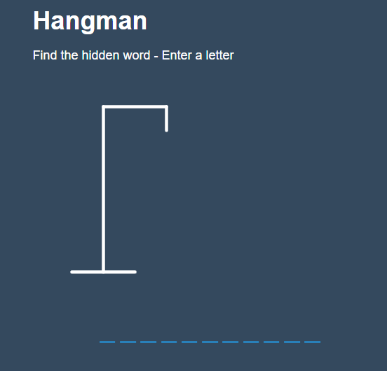
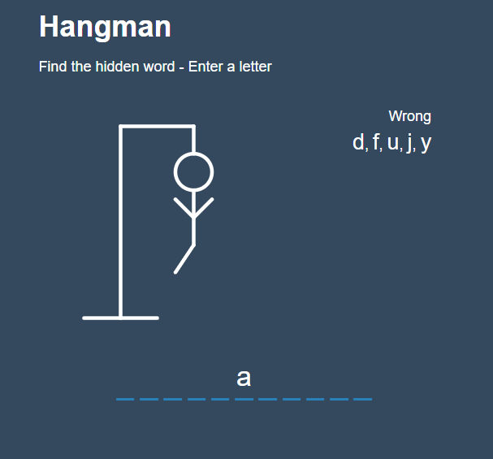

# React-Hangman

React Hangman Game

<!-- Live link to deployed app -->

Repository: https://github.com/Mdudzik92/React-Hangman 
Deployed app: https://dudzik-hangman.herokuapp.com/

<!-- Technologies used -->

JavaScript, React, React Hooks

<!-- Explanation of what the app is -->

This is a simple Hangman app built with React and powered by JavaScript. The game allows the user to type in a limited number of letters to guess a specific word. If they guess 6 incorrect letters, a popup box alerts them that they have lost and gives them the option to play again. If they guess correct, a popup box lets them know they've won. Give it a try!

<!-- Screenshot -->

<!-- License -->

MIT

<!-- Contact information -->

Email: mdudzik92@gmail.com
